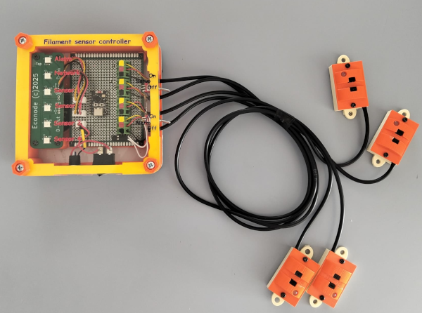
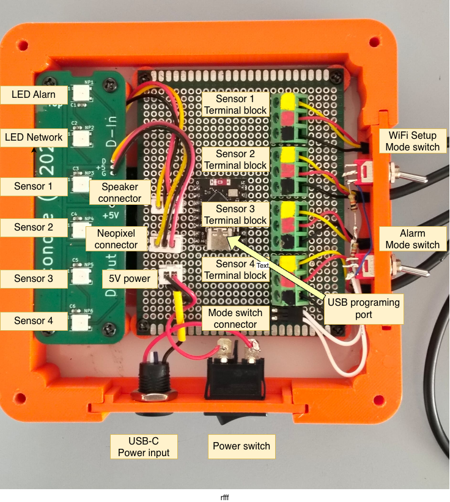
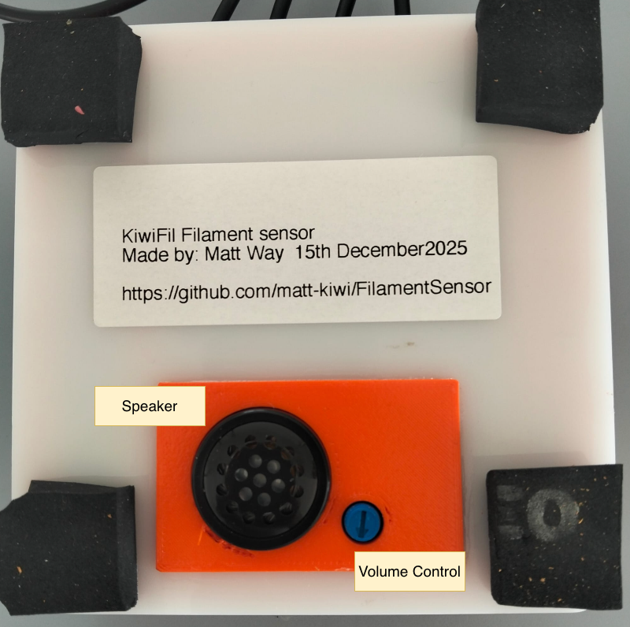
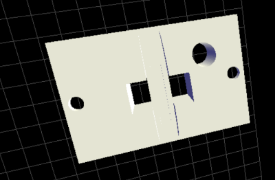
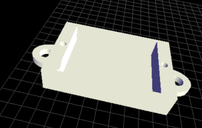
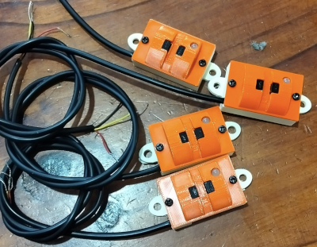
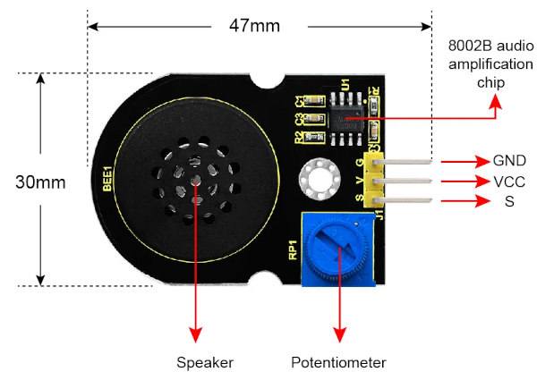

# Filament sensor and controller

## Project summary / purpose

Used in the manufacturing process of making and recycling plastic. Specifically to detect if a strand of filament has been broken, then alert the operator with an audio alarm.

### Dedicated to Bill and Eva

This device is dedicated to Bill and Eva of KiwiFil plastics in New Zealand. And their pioneering work with plastics recycling.

## Usage and wiring

### Wiring

- Remove top lid with finger screws.
- Pull out switch block assembly / cable entry plate.
- Connect all 4 filament sensors using screw terminals, if a sensor is missing bridge Ground and Sensor input (Yellow).
- Install switch block assembly aligning sensor cables in combe/clamp.
- Install top lid

### Usage

Controller is powered by USB/5v some USB-C PD power supplies may not work. 
Turn on power switch, during boot up the first LED will be blue, and a power up tune will be played.

\*\* One day when the WiFi software has been written the WiFi setup switch will enable configuring the WiFi

The "Alarm mode" switch enables or disables the audible alarm.

The alarm will sound when any of the sensors fail to detect filament. 
LEDs

- Alarm: Red in alarm, Green no alarm
- Sensors 1 - 4: Red in alarm, Green no alarm

Adjusting the volume, the underside of the controller has a 2 Watt speaker and volume control, turn clockwise to increase the volume.

## Filament Sensors

Using an IR slot sensor, commonly used for a speed / position sensor, can run at 3.3v or 5v. 
Output is via LM393 voltage comparator producing a stable digital output with +VCC being open and 0V closed.

STL files to print 3D printed casings can be found here [STL Files](hardware_optical_sensor) 
  

Completed sensors with 3D printed housing 

## Controller

Hardware files, 3D print STL files, and laser cut SVGs can be found here [STL Files](hardware_ESP32_controller)

ESP32 C3 Super Mini

CONNECTIONS:

- 5V → Power Input (USB or external 5V)
- GND → Common Ground
- 3V3 → 3.3V Output (for sensors)
- GPIO4 → Mode Switches (ADC input)
- GPIO3 → Speaker Output
- GPIO2 → NeoPixel Data
- GPIO5 → Sensor 4 Signal
- GPIO10 → Sensor 3 Signal
- GPIO20 → Sensor 1 Signal
- GPIO21 → Sensor 2 Signal
- GPIO8 → Status LED (built-in)

## Schematic ( Vero Board prototype )

Schematic PDF File here: [FilamentSensorProjectVeroBoard.pdf](docs/FilamentSensorProjectVeroBoard.pdf) 

## Sound / Alarm

Alarm will sound when any of the 4 sensors don't detect any filament. 
Sound can be disabled by turning the "Alarm" switch to off. 
Volume can be adjusted by the volume knob on the underside of the control unit. 

The sound library is by Econode using RTTTL / Nokia ringtones.
[https://github.com/matt-kiwi/ESP32-C3-RTTTL_MusicPlayer](https://github.com/matt-kiwi/ESP32-C3-RTTTL_MusicPlayer) 

Amplifier and Speaker unit; 

## Network / WiFi

Not currently implemented, the ESP32-C3 module has WiFi and antenna, there is a "setup mode" switch.

I envisage in the future all the factory alarms etc will be network enabled.
